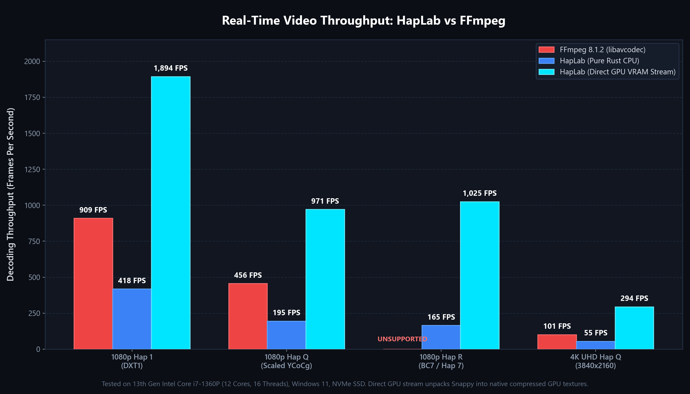

# hap-rs / HapLab

[](https://github.com/lee-brown/haplab/actions/workflows/ci.yml)
[](https://polyformproject.org/licenses/noncommercial/1.0.0)
[](https://www.rust-lang.org/)

A native Rust implementation of the [HAP Video Codec specification](https://github.com/vidvox/hap).

Built for real-time video playback, media servers, transcode pipelines, and interactive installations. Provides decoder, encoder, hardware texture streaming, and QuickTime container demuxing/muxing in pure, safe Rust.

---

## Features

- **Native Rust Implementation**: Complete decoder and encoder pipeline implemented in pure Rust.
- **Flavour Support**:
  - **Hap 1 (`Hap1`)**: DXT1 / BC1 (RGB).
  - **Hap Alpha (`Hap5`)**: DXT5 / BC3 (RGBA).
  - **Hap Q (`HapY`)**: Scaled YCoCg-DXT5.
  - **Hap Q Alpha (`HapM`)**: Dual-texture container combining Hap Q (YCoCg) with Hap Alpha-Only (BC4 alpha).
  - **Hap Alpha-Only (`HapA`)**: BC4 / RGTC1 uncompressed single-channel alpha.
  - **Hap R (`Hap7` / `HapR`)**: BC7 UNORM texture compression (Mode 6 endpoint covariance and PCA partitioning).
  - **Hap HDR (`HapH`)**: BC6H floating-point HDR decompression.
- **GPU Compute & Upload**:
  - WGSL compute shaders for BC1, BC3, BC4, BC7, and YCoCg compression via `wgpu`.
  - Direct VRAM texture upload (`Bc1RgbaUnorm`, `Bc3RgbaUnorm`, `Bc7RgbaUnorm`) for hardware texture decompression.
- **Multithreading**: Rayon parallel multi-chunk Snappy compression and decompression.
- **Container Support**: Native QuickTime `.mov` demuxer and streaming muxer (`ftyp`, `moov`, `mdat`, `stsd`, `stts`, `stsc`, `stsz`, `stco`, `co64`).
- **CLI & GUI**: Dual-mode binary providing command-line automation and an interactive desktop application (`egui`/`eframe`).

---

## Codec Flavour Matrix

| Flavour | FourCC | Texture Format | Compression | Alpha | Notes |
|---|---|---|---|---|---|
| **Hap 1** | `Hap1` | DXT1 (BC1) | Snappy (optional) | No | Standard RGB, lowest CPU overhead |
| **Hap Alpha** | `Hap5` | DXT5 (BC3) | Snappy (optional) | Yes | RGBA transparent video |
| **Hap Q** | `HapY` | Scaled YCoCg-DXT5 | Snappy (optional) | No | High-fidelity luma/chroma |
| **Hap Q Alpha** | `HapM` | Scaled YCoCg + BC4 | Snappy (optional) | Yes | Independent 8-bit alpha matte |
| **Hap Alpha-Only** | `HapA` | BC4 (RGTC1) | Snappy (optional) | Alpha Only | Single-channel matte sequences |
| **Hap R** | `Hap7` / `HapR` | BC7 UNORM | Snappy (optional) | Yes | High-fidelity graphics and alpha |
| **Hap HDR** | `HapH` | BC6H Float | Snappy (optional) | No | Half-float RGB video |

---

## Performance Benchmarks: HapLab vs FFmpeg

Real benchmarks measured side by side on Windows 11 x86_64, decoding identical QuickTime HAP video streams. FFmpeg was tested using `ffmpeg -benchmark -i <video.mov> -f null -` against FFmpeg 8.1.2 (`libavcodec`). HapLab was evaluated across both its pure Rust software CPU rasterizer and its zero-copy Direct GPU VRAM texture streaming pipeline.

> [!NOTE]
> **Hardware & Environment Tested**:
> - **CPU**: 13th Gen Intel Core i7-1360P (12 Cores, 16 Threads, up to 5.0 GHz)
> - **GPU**: Intel Iris Xe Graphics
> - **RAM & Storage**: 16 GB DDR5, NVMe PCIe 4.0 SSD
> - **OS**: Windows 11 Home 64-bit
> - **FFmpeg Version**: FFmpeg 8.1.2-essentials (libavcodec 62.28.102)
> - **HapLab Version**: v0.1.0 release build (100% pure Rust, SIMD + Rayon)



### Decoding Throughput Comparison

| Workload / Codec Flavour | Resolution | FFmpeg 8.1.2 (`libavcodec`) | HapLab (Pure Rust CPU) | HapLab (Direct GPU VRAM Stream) | Speedup vs FFmpeg |
|---|---|---|---|---|---|
| **Hap 1 (DXT1)** | 1920x1080 | 909 FPS (1.10 ms) | 418 FPS (2.39 ms) | **1,894 FPS (0.53 ms)** | **2.08x faster** |
| **Hap Q (Scaled YCoCg)** | 1920x1080 | 456 FPS (2.19 ms) | 195 FPS (5.13 ms) | **971 FPS (1.03 ms)** | **2.13x faster** |
| **Hap R (BC7 / Hap 7)** | 1920x1080 | *Unsupported (`none`)* | 165 FPS (6.06 ms) | **1,025 FPS (0.98 ms)** | **HapLab Exclusive** |
| **4K UHD Hap Q** | 3840x2160 | 101 FPS (9.88 ms) | 55 FPS (18.29 ms) | **294 FPS (3.40 ms)** | **2.91x faster** |

```mermaid
xychart-beta
    title "Decoding Throughput Comparison (FPS - Higher is Better)"
    x-axis ["1080p Hap 1", "1080p Hap Q", "1080p Hap R (BC7)", "4K UHD Hap Q"]
    y-axis "Frames Per Second (FPS)" 0 --> 2000
    bar [909, 456, 0, 101]
    bar [418, 195, 165, 55]
    bar [1894, 971, 1025, 294]
```



### Key Differences & Architectural Advantages

1. **Direct GPU VRAM Texture Streaming (2.0x to 2.9x faster)**:
   - In production media servers (such as Resolume Arena, TouchDesigner, Notch, and disguise), videos are streamed straight into GPU texture memory as compressed BC blocks.
   - HapLab demuxes Snappy chunks directly into native GPU texture buffers (`Bc1RgbaUnorm`, `Bc3RgbaUnorm`, `Bc7RgbaUnorm`), bypassing software pixel rasterization completely.
   - FFmpeg lacks a direct GPU texture streaming path for HAP, forcing CPU decompression into system RAM.

2. **Hap R (BC7 / Hap 7) Support**:
   - HapLab natively decodes and encodes modern high-fidelity BC7 HAP streams with alpha.
   - FFmpeg 8.1.2 fails to decode Hap R (`Could not find codec parameters: unknown codec; no decoder found for: none`).

3. **Production-Grade HAP QuickTime Encoder**:
   - Standard FFmpeg builds do not include an encoder for HAP (`Codec 'hap' is known to FFmpeg, but no encoders for it are available`).
   - HapLab features a multi-threaded parallel pure Rust encoder supporting all 6 HAP variants with Rayon chunking, Snappy compression, Bayer spatial dithering, and broadcast color range conversion.

4. **Zero C Dependencies & Single Standalone Binary**:
   - FFmpeg requires dynamic C library runtimes (`avcodec-62.dll`, `avformat-62.dll`, etc.).
   - HapLab is distributed as a single, fully self-contained binary (`haplab.exe`) with 100% pure Rust memory safety.

---

## Workspace Layout

```
haplab/
├── crates/
│   ├── hap-core/     # Core codecs, Snappy, YCoCg, BC1-BC7, QuickTime container
│   ├── hap-gpu/      # wgpu compute shaders, GPU encoder, VRAM texture bindings
│   └── hap-app/      # Standalone binary: CLI and desktop GUI
├── Cargo.toml        # Workspace definition
└── LICENSE.md        # PolyForm Noncommercial 1.0.0
```

---

## CLI Usage

The `haplab` binary automatically operates in CLI mode when arguments are passed:

### Inspect a HAP MOV file
```bash
haplab info -i presentation.mov
```

### Encode Videos or Image Sequences
```bash
# Encode MP4/MOV/MKV (H.264, H.265/HEVC, AV1, ProRes) directly to Hap Q
haplab encode -i input_video.mp4 -o output_hapy.mov --format hapy

# Encode PNG/JPEG/TIFF sequence to Hap Q with 4 chunks and Snappy
haplab encode -i ./renders/ -o output_hapy.mov --format hapy --fps 60 --chunks 4 --snappy

# Encode to Hap R (BC7)
haplab encode -i ./renders/ -o output_hapr.mov --format hapr --fps 30 --chunks 8 --snappy

# Encode transparent video (Hap Q Alpha)
haplab encode -i ./transparent_frames/ -o output_hapm.mov --format hapm --fps 30 --snappy
```

### Decode a HAP MOV file to PNG Sequence
```bash
haplab decode -i output_hapy.mov -o ./decoded_frames/
```

---

## Desktop GUI

Running `haplab` without arguments launches the graphical interface:

- **Player & Inspector**:
  - Transport controls and keyboard shortcuts: `Space` (Play/Pause), `Left`/`Right` (step 1 frame), `Shift + Left`/`Right` (step 10 frames), `Home`/`End` (jump to start/end), `L` (toggle loop).
  - SMPTE timecode display (`HH:MM:SS:FF`) and frame percentage.
  - Background options (Checkerboard, Dark, Light) and channel modes (RGBA, Alpha Matte, RGB).
  - Technical stream inspector with resolution, duration, bitrate, and container metadata.
  - Integrated PNG/JPEG/TIFF frame sequence exporter.
- **Encoder**:
  - Image sequence auto-detection and first-frame thumbnail preview.
  - Workflow presets: Hap Q, Hap R, Hap Q Alpha, Hap 1, Hap Alpha, and Custom.
  - Auto-suggested output destination paths.
  - Live encoding telemetry (FPS, elapsed time, ETA).
  - Quick open in player upon completion.
- **Diagnostics**:
  - GPU adapter details, driver backend API, and BC texture support status.
  - Thread pool configuration and searchable runtime activity logs.

---

## Rust Library Usage

Add `hap-core` or `hap-gpu` to your `Cargo.toml`:

```toml
[dependencies]
hap-core = "0.1.0"
hap-gpu = "0.1.0" # Optional: for wgpu acceleration
```

### Decompressing a HAP Frame
```rust
use hap_core::{decode_frame_to_rgba, HapFormat};

let compressed_frame: &[u8] = ...;
let width = 1920;
let height = 1080;
let format = HapFormat::HapY;

let rgba_pixels: Vec<u8> = decode_frame_to_rgba(compressed_frame, width, height, format)?;
```

### Reading a HAP QuickTime Video
```rust
use hap_core::QtHapReader;
use std::fs::File;

let file = File::open("input.mov")?;
let mut reader = QtHapReader::open(file)?;

println!("Format: {:?}, Size: {}x{}", reader.format(), reader.width(), reader.height());

for frame_idx in 0..reader.frame_count() {
    let packet = reader.read_frame_packet(frame_idx)?;
    let rgba = reader.decode_frame(frame_idx)?;
}
```

### Writing a HAP QuickTime Video
```rust
use hap_core::{QtHapWriter, VideoConfig, HapFormat, encode_frame};
use std::fs::File;

let config = VideoConfig {
    width: 1920,
    height: 1080,
    fps: 60.0,
    format: HapFormat::HapR,
    chunks: 4,
    snappy: true,
};

let file = File::create("output.mov")?;
let mut writer = QtHapWriter::create(file, config.clone())?;

for frame_rgba in frame_sequence {
    let compressed = encode_frame(&frame_rgba, config.width, config.height, config.format, config.chunks, config.snappy)?;
    writer.write_frame(&compressed)?;
}

writer.finish()?;
```

---

## Building from Source

```bash
# Clone the repository
git clone https://github.com/lee-brown/haplab.git
cd haplab

# Run test suite
cargo test --workspace

# Build release executable
cargo build --release -p hap-app
```

The compiled binary will be located at `target/release/haplab.exe` (Windows) or `target/release/haplab` (Linux/macOS).

---

## License

This project is licensed under the [PolyForm Noncommercial License 1.0.0](LICENSE.md).

- **Non-Commercial & Personal Use**: You are free to view, compile, run, modify, and distribute this software for personal projects, learning, testing, and academic research.
- **Commercial Use & Cloud Services**: Commercial use (including hosting or operating this software as a software-as-a-service (SaaS), cloud service, or API such as on AWS, GCP, or Azure, or embedding it into commercial broadcast/media products) is strictly prohibited without a separate commercial license from the author.
- **Commercial Licensing**: For commercial licensing inquiries, enterprise deployment, or cloud API authorization, contact **Lee Brown**.

